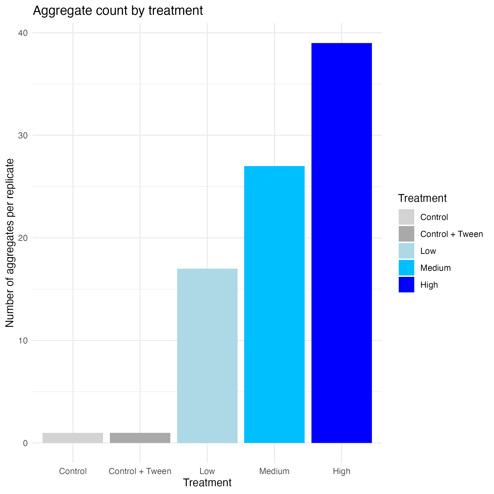
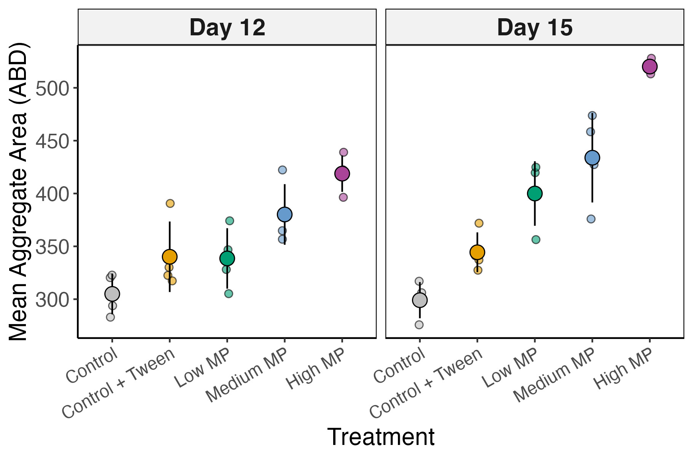

```{r setup, include = FALSE, echo = FALSE}
library(tidyverse)
library(here)
library(renv)
library(grateful)
library(trackdown)
```

**INTRODUCTION**

Plastic pollution is a global environmental problem. For decades, an abundance of plastic products have been made to supply the daily convenience needs of humans, while ineffective waste management strategies have led to a concomitant rise in plastic waste found ubiquitously in global ecosystems [@li2020]. Once in the environment, plastic can be degraded physically and chemically through natural processes to eventually break down into miniscule fragments [@zhang2021]. Of particular interest are plastic particles smaller than 5mm in length, known as microplastics, which are harder to track and more easily transported via natural forces, potentially over great distances owing to their small size [@haque2023]. @haque2023 distinguish between microplastics that are intentionally manufactured for use in cosmetics (primary microplastics) and microplastics that are produced from the degradation of larger plastic products (secondary microplastics). Primary microplastics are more easily regulated, whereas secondary microplastics are of larger concern since they are much harder to quantify, track, and mitigate without staunching the production of plastic materials upstream.

Microplastic pollution in aquatic environments has been shown to have ecotoxicological effects on various aquatic organisms, such as zooplankton and benthic invertebrates, raising concern for broader ecological impacts [@vo2021]. Phytoplankton are also impacted by microplastic pollution, with demonstrated effects on their photosynthetic activity, growth rate, oxidative defense, and colony formation [@prata2019]. As primary producers in aquatic food webs, understanding the sensitivity of phytoplankton to microplastic pollution is critical to predict ecosystem health in polluted environments.

Some species of phytoplankton form colonies of 2 to 8 cells stacked together in response to environmental stressors such as predator grazing, but they also form larger colonies called aggregates in response to prolonged or more severe environmental stressors [@lürling2003]. In the presence of microplastics, some species of phytoplankton have been observed to form aggregates. This is thought to be a potential defense mechanism whereby algae increase their size to reduce the available surface area that can interact with MP [@guo2024]. Due to their increased biomass, aggregates have a faster sinking rate compared to smaller colonies or individual algae cells [@long2015]. This exacerbates the removal of phytoplankton from the upper water column (the euphotic zone) which may decrease photosynthetic activity and reduce food availability for consumers, thereby potentially having significant consequences for ecosystem productivity. [@parrella2024] showed that heteroaggregates comprised of algal cells and microplastics have a faster sinking rate than homoaggregates comprised of only algal cells. This suggests another avenue through which microplastic pollution may alter aquatic ecosystem dynamics.

The published literature on this topic has mainly focused on verifying the presence or absence of aggregates with microscopy techniques, while overlooking the need to quantify the changes in algal aggregation behaviour upon exposure to microplastics. This research project aimed to characterise the impact of microplastic pollution on the aggregation of phytoplankton under experimental conditions, using the freshwater green alga *Tetradesmus obliquus* as a representative species.


**MATERIALS AND METHODS**

*Experimental setup*

Cultures of *Tetradesmus obliquus* in COMBO media (CPCC 5, Canadian Phycological Culture Centre, University of Waterloo, Canada) were exposed to three different experimental concentrations of microplastics (MP): “low” (100MP/mL; 4mg/L, n=4), “medium” (1,000MP/mL; 40mg/L, n=4), and “high” (10,000MP/mL; 400mg/L, n=4). Treatment cultures were assembled in 50mL Falcon Tubes containing approximately 4 million algal cells and with 0.004% Tween20. Experimental treatments were incubated at 24ºC under a 12:12 light:dark cycle for 15 days. Samples for analysis were collected on Day 1, Day 12, and Day 15.

*Data collection*

On days 1, 12, and 15 of the experiment, samples from each biological replicate (n=4) were taken and the number and size of algal aggregates were measured using a FlowCam 8400 machine with the corresponding VisualSpreadsheet software (Version 6, Fluid Imaging Technologies). A 100um FlowCell and a 10x objective lens were used, while the FlowCam context settings were set to 0.1mL/min flow rate (approx. 50% efficiency) with 4um minimum threshold particle size for imaging.

*Aggregation behaviour analysis*

Changes in aggregation behaviour were measured based on the proportion of algal aggregates in the total population. To differentiate single algal cells from stacked algal colonies and from algal aggregates, the FlowCam imaging data was sorted by convex perimeter which was visually ascertained to be the parameter that best separated cells, stacks, and aggregates. To further sort the aggregates from the rest of the data, a threshold convex perimeter of 80um was chosen, again based on visual analysis of the imaging data. The total number of images collected by the FlowCam correspond to the total cell count of the sample, and the number of images above the 80um convex perimeter threshold correspond to the number of aggregates present in the sample.

To standardise differences in total cell count between samples, the proportion of algal aggregates (calculated by dividing the number of aggregates by the total cell count for each sample) was compared across treatments. Data collected on days 12 and 15 were also normalised to day 1 counts. A linear mixed effects model (Proportion aggregate \~ Treatment + (1\|Replicate)) was run to determine any statistical differences across microplastic treatments.


**RESULTS**

*Algal aggregation behaviour*

Changes in *T. obliquus* aggregation behaviour were measured across microplastic concentrations by calculating the mean proportion of aggregates in algal cultures across treatments. Importantly, the presence of the Tween20 surfactant alone did not have an effect on the proportion aggregate compared to the control without the Tween20 surfactant added (ANOVA, p \> 0.05) (Fig. 1).

Interestingly, samples collected on Day 1 of the experiment (hours after adding the microplastics to algal cultures) showed a rapid and dose dependent response to the microplastic treatments (Fig. 1).

 Figure 1. Bar plot showing the number of algal aggregates across microplastic treatments on day 1 of the experiment.

*Algal aggregate size*

In addition to increasing the number of aggregates, exposure to higher concentrations of microplastics also increased the size of the algal aggregates in culture. Based on the FlowCam imaging data, the area of particles captured could be measured to provide information on changes to aggregate size across treatments. We found that aggregate area increased with microplastic concentration (Fig. 2).

 Figure 2. Area of microalgal aggregates across microplastic treatment groups.

```{r, echo = FALSE}
grateful::cite_packages(output = "paragraph", out.dir = ".")
```
